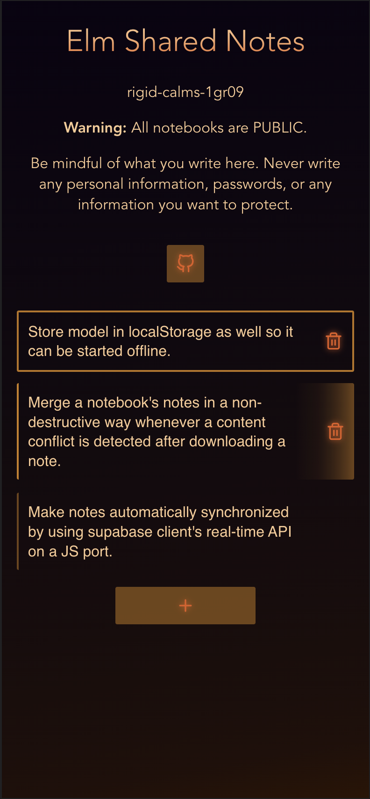
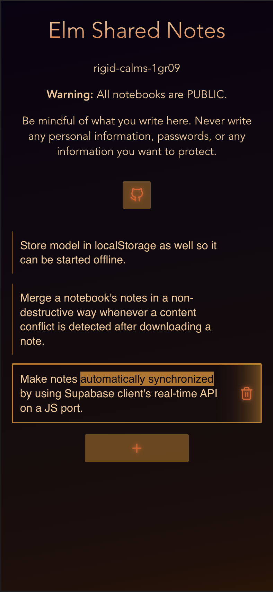
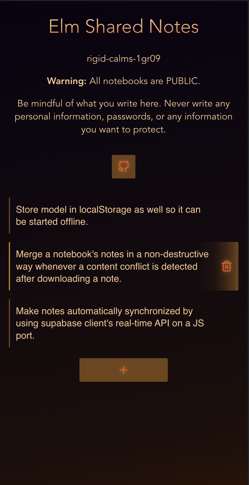

# Elm Shared Notes

A real-time collaborative offline-first notebook written in Elm.

Features:

- [ ] Shareable rooms (a.k.a. notebooks).
- [x] Automatic notebook creation on enter.
- [x] Human-friendly unique notebook IDs.
- [x] Add, update and delete notes.
- [x] Sleek design (it looks cooler than I expected).
- [ ] Notes are stored in the cloud.
- [ ] Notes are also stored in the browser.
- [ ] Notes are duplicated on conflict.
- [ ] Real-time multi-user edition of notes.
- [ ] Undoable note deletion.
- [ ] Optimised requests.

  

## Stack

Serverless Elm client app. Uses Supabase as a DB.

Uses Supabase JS client for the real-time updates.

Expedited with [vite-elm-template](https://github.com/lindsaykwardell/vite-elm-template).

See package.json scripts. For more information about Vite, check out [Vite's official documentation.](https://vitejs.dev/).
